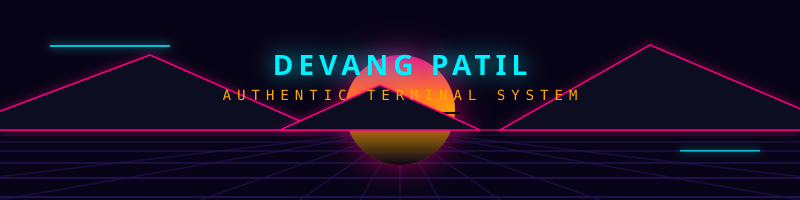

<p align="center">
  
</p>

<p align="center">
  <a href="https://git.io/typing-svg">
    
  </a>
</p>

---

<p align="center">
  <a href="https://dev-angpatil.github.io/Dev-angPatil/">
    
  </a>
</p>

---

<p align="center">
  
</p>

---

## 🎮 Cyberpunk Neon Tetris Game

This repository serves as Devang's official GitHub profile page and hosts **Neon Tetris**, a web-based cyberpunk-themed arcade experience written in vanilla HTML5, Canvas, and CSS.

### Key Game Features:
- **WebGL-style 2D Canvas**: High-fidelity neon lighting shadows and active cell glow effects.
- **Web Audio API Synthesizer**: Generates dynamic retro sound frequencies programmatically (movement clicks, rotation sine sweeps, line-clear arpeggios, and descending sawtooth game-over notes) without external audio file loading.
- **Ghost Projection**: Shows real-time block drop guides for precision landing.
- **Dynamic Speed Calibration**: Automatically scales drops speed (reducing millisecond intervals) on level completions.
- **Responsive Layout**: Adjusts layout for mobile display and includes overlay panels for touch gestures.

---

## 🛠️ Tech Stack & Equipment Inventory

<p align="center">
  <a href="https://skillicons.dev">
    
  </a>
</p>

---

## 📂 Project Structure

```text
Dev-angPatil/
├── .github/
│   └── workflows/
│       └── main.yml        # CI/CD pipeline building contribution grid snake
├── images/
│   ├── header-banner.svg   # Skyline profile banner
│   ├── profile-card.svg    # Character stat board card
│   ├── play-btn.svg        # Neon button linking to game deploy
│   └── github-contribution-grid-snake.svg
├── index.html              # Neon Tetris game implementation page
└── README.md               # GitHub Profile README file (this file)
```

---

## 🚀 How to Run the Game Locally

1. **Clone the Repository**:
   ```bash
   git clone https://github.com/Dev-angPatil/Dev-angPatil.git
   cd Dev-angPatil
   ```
2. **Open index.html**:
   Double click the `index.html` file or launch it using any local HTTP static server (e.g. `npx serve` or Live Server extension).
3. **Play**:
   - Use `A` / `D` or `Arrow Keys` to move left and right.
   - Use `W` or `Up Arrow` to rotate.
   - Use `S` or `Down Arrow` for soft drop.
   - Use `Space` for instant hard drop.
   - Press `P` to pause/resume.

---

## 📊 System Diagnostics & Metrics

<p align="center">
  <!-- GitHub Readme Stats Card (Synthwave/Outrun Customized Theme) -->
  
  &nbsp;&nbsp;
  <!-- GitHub Streak Card (Customized Theme) -->
  
</p>

---

## 🐍 Contribution Grid Journey

<p align="center">
  <!-- Generated via Snake Action -->
  
</p>

<p align="center" style="font-family: monospace; font-size: 11px; color: #8b80b6;">
  🚀 <i>Automated grid scan sweeps every 24 hours. Last execution status: ONLINE.</i>
</p>

---

## 🤖 AI Developer Notes

### Context & Second Brain Mapping
- **Second Brain Notes**: Review active tasks and profile preferences under:
  [Ctx - Dev-angPatil Context](file:///home/deu/Documents/Technical%20&%20Academins/10%20AI/Context/Coding%20Repos/Dev-angPatil/Ctx%20-%20Dev-angPatil%20Context.md) and [Ctx - Dev-angPatil Inbox](file:///home/deu/Documents/Technical%20&%20Academins/10%20AI/Context/Coding%20Repos/Dev-angPatil/Ctx%20-%20Dev-angPatil%20Inbox.md).

### Codebase Invariants
- **Web Audio API context rules**: Browser security prevents synthesizing audio until the user interacts with the page. Sound is initialized asynchronously via click listeners on the main start button.
- **Tetris Board Size**: The play grid is strictly defined as `12 columns` by `24 rows` scaled by `20` within the canvas. Changing block grids requires adjustments to the matrix bounds in `index.html`.
- **Snake Action Workflow**: The contribution grid snake is generated automatically by a GitHub action workflow running daily. Do not modify the target filename in `/images/github-contribution-grid-snake.svg` directly as it will break the automated generation pipeline.
